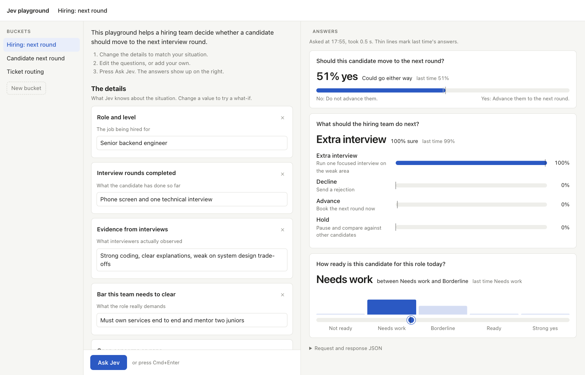

# jev-playground

A Cline plugin that lets anyone ask Jev (TypeSafe's System One judgment API) questions without writing JSON. You describe a situation to Cline, the agent sets up a small form of details and questions, and a local page opens in your browser. From there anyone can change the details, edit or add questions, press **Ask Jev**, and see the answers as charts. The agent only sets things up; every number comes from Jev.



## What it does

- **One tool, `ask_jev`.** The agent fills plain fields (details, and questions with options or levels). The plugin builds the System One request from them, so the model never writes the API's nested JSON.
- **Playground mode.** With `playground: true` the tool saves the setup as a *bucket*, starts a local server if needed, and opens `http://127.0.0.1:4747`. No LLM is involved after that point: the page calls Jev directly.
- **Three answer types.** Each question is one of:
  - **Yes / no** (`noul`): how likely yes is, from 0% to 100%.
  - **Pick one** (`choice`): picks one of your options and shows how sure it is about each.
  - **Scale** (`score`): places the answer between your levels, lowest first.
- **What-ifs.** Change a value and ask again. A thin marker and a "last time" note show where each answer was on the previous run.
- **Quick answers and templates.** Without the playground, `ask_jev` answers in the chat. It also accepts pasted JSON: a filled template, or a raw System One request.

## Layout

```
plugin/index.ts              the ask_jev tool and the rule telling the agent when to use it
plugin/jev-flat.mjs          builds System One requests from plain fields (shared by tool and page)
plugin/jev-core.mjs          request validation, API key lookup, HTTP call to System One
plugin/plugin-transport.mjs  live call, or an answer shape when no key is set
plugin/playground.mjs        local server on 127.0.0.1:4747, plus the code that starts it and opens the browser
plugin/playground.html       the page (one file, no dependencies)
examples/                    ready-made buckets
jev.config.example.json      key file format
```

## Prerequisites

- The [Cline CLI](https://docs.cline.bot) (tested on 3.0.64).
- `node` 18 or newer on your `PATH`. The playground server runs as a separate `node` process.
- A TypeSafe API key. Without one, the tool still validates requests and returns the answer *shape*, but no scores.

## Install

From a clone of this repo:

```bash
cline plugin install ./jev-playground/plugin --force
```

Install the `plugin/` directory, not a single file, so the modules next to `index.ts` come along.

Then give it your key. Either set an environment variable:

```bash
export TYPESAFE_API_KEY=your-key
```

or write the key file the plugin reads by default:

```bash
cp jev-playground/jev.config.example.json ~/.cline/plugins/jev.config.json
# edit the file and put your key in, then:
chmod 600 ~/.cline/plugins/jev.config.json
```

The plugin looks for a key in this order: `TYPESAFE_API_KEY`, then the file named by `JEV_CONFIG` (or `~/.cline/plugins/jev.config.json` when that is unset), then a `.env` file one level above the running `plugin/` directory. That last one only matters when you run the server straight from the repo, where it means `jev-playground/.env`. Never commit a real key; the repo's `.gitignore` already excludes `.env` files.

## Run Cline so the tool loads

Plugin tools only load when the session runs inside the CLI process. Sessions that go through the Cline desktop app's background hub get the plugin's rule but not its tools. So:

- **Interactive:** start `cline --yolo`. Plain interactive `cline` uses the hub. Note that `--yolo` approves tool calls without asking.
- **One-shot:** `cline "your prompt"` works when `CLINE_SESSION_BACKEND_MODE=local` is set (`export CLINE_SESSION_BACKEND_MODE=local` in your shell profile).
- **Desktop app:** the tool is not available there yet.

Check it loaded by asking `what tools do you have?`. The list should include `ask_jev`.

## Try it

Set up a playground (it opens in the browser):

```
make a jev page where our hiring team can check if a candidate should go to the next round
```
```
set up a jev playground for deciding whether to rent or buy a flat
```
```
i want my support team to play around with jev for routing tickets. set it up so they can try stuff
```
```
set up something my mom can use to check if a message she got is a scam
```

Ask once, in the chat:

```
use jev, should i take the job offer? current pay 18L, offer 26L, but it's a 6 month old startup
```

Templates and pasting:

```
give me a jev template i can fill in myself for picking a vacation spot
```
```
run this: <paste a filled template or any Jev request JSON>
```
```
open this in the jev playground: <paste a template>
```

Say "jev" or "use jev" in the prompt. The plugin's rule only activates when you ask for a judgment, so ordinary coding prompts are left alone.

## The hiring example

[`examples/hiring-next-round.json`](examples/hiring-next-round.json) is the bucket Cline made for the hiring prompt above: five details (role, rounds done, interview evidence, the bar, open concerns) and three questions (should they advance, what to do next, how ready are they). To use it:

- **Through Cline:** `open this in the jev playground: ` followed by the file's contents, or `run this: ` followed by the contents to get one answer in the chat.
- **Without Cline:** copy it into the bucket folder and start the server yourself:

  ```bash
  mkdir -p ~/.cline/plugins/jev-buckets
  cp jev-playground/examples/hiring-next-round.json ~/.cline/plugins/jev-buckets/
  node jev-playground/plugin/playground.mjs
  # open http://127.0.0.1:4747/#hiring-next-round
  ```

A bucket file is plain JSON you can write by hand:

```json
{
  "name": "Hiring: next round",
  "about": "One sentence on what this helps decide.",
  "inputs": [
    { "label": "Role and level", "value": "Senior backend engineer", "hint": "The job being hired for" }
  ],
  "questions": [
    { "id": "next_round", "type": "noul", "question": "Should this candidate move to the next round?",
      "yes_means": "Advance them.", "no_means": "Do not advance them." },
    { "id": "next_step", "type": "choice", "question": "What should the hiring team do next?",
      "options": [{ "name": "Advance", "meaning": "Book the next round now" },
                  { "name": "Extra interview", "meaning": "One focused interview on the weak area" }] },
    { "id": "readiness", "type": "score", "question": "How ready are they for this role today?",
      "levels": ["Not ready", "Needs work", "Borderline", "Ready", "Strong yes"] }
  ]
}
```

Jev receives the details as a `{label: value}` object and each question as its own judgment. The `about` line and the hints only appear on the page and are never sent to Jev.

## How it works

1. You ask Cline. The agent calls `ask_jev` with `playground: true`, a bucket name, an `about` line, labeled details with hints, and two or three starter questions.
2. The plugin checks the setup with the same builder the page uses, saves it to `~/.cline/plugins/jev-buckets/<name>.json`, starts the server if it isn't running, and opens the page.
3. On the page, edits are saved automatically. **Ask Jev** (or Cmd/Ctrl+Enter) sends the bucket to the local server. The server builds and validates the request, calls `POST https://api.typesafe.ai/v1/systemone` with your key, checks that every question got a valid answer, and stores the result with the bucket.
4. A bad edit, such as a pick-one question with a single option, shows plain-language errors on the page and never reaches the API.

## Security

- The server listens on `127.0.0.1` only.
- The API key stays in the server process and is never sent to the browser.
- Requests with a foreign `Host` header (DNS rebinding) or a foreign `Origin` (another website posting to localhost) are refused, so other sites can't spend your credits.
- Buckets and the server log live in `~/.cline/plugins/jev-buckets/`, outside the repo.

## Operating the server

- Health check: `curl 127.0.0.1:4747/health`
- Stop: `curl -X POST 127.0.0.1:4747/shutdown`
- Log: `~/.cline/plugins/jev-buckets/server.log`
- The server outlives the Cline session on purpose, so the page keeps working after the agent finishes. After a reinstall, the next playground call replaces a running server whose code or location changed.

## Troubleshooting

- **The agent answers in prose and never calls Jev.** The tool didn't load (see [Run Cline so the tool loads](#run-cline-so-the-tool-loads)), or the prompt didn't ask for a judgment. Add "use jev".
- **The page doesn't open.** Check `~/.cline/plugins/jev-buckets/server.log`, and check that `node` is on the `PATH` Cline runs with.
- **Port 4747 is taken by something else.** The tool reports it and stops. Free the port and ask again.
- **Answers say "shape" instead of numbers.** No key was found. See [Install](#install).

## Known limitations

- Plugin tools don't load in the Cline desktop app or in hub-backed interactive sessions. Use `cline --yolo` or one-shot mode.
- The port is fixed at 4747.
- Jev's answers move a little between runs for borderline cases. Trust the answers that stay put when you ask again.

## License

MIT, see [LICENSE](LICENSE).
